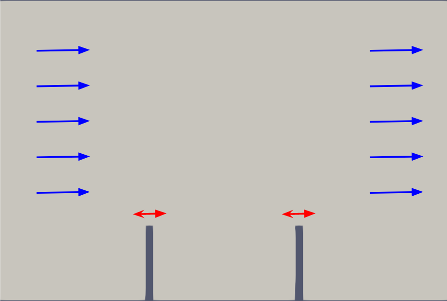

# Multi-Coupling: Two Perpendicular Flaps

In the following tutorial we model a fluid flowing through a channel. 
Two solid, elastic flaps are fixed to the floor of this channel.
The flaps oscillate due to the fluid pressure building up on its surface. This case is an example for multi-coupling: a fluid and two solids are coupled together using a fully-implicit multi-coupling scheme.

## Case Setup

The case setup is shown here:



The simulated flow domain is 6 units long (x) and 4 units tall (z). The flaps are clamped at the bottom (z=0) and they are 1 unit tall (z), 0.1 units long (x), and 0.3 units wide (y). Being located at x=-1 and x=1, the flaps split the domain into three equal parts. 

This is a quasi-2D simulation, with one cell in width and empty conditions are imposed on the front and back. 

The inflow velocity is 5 m/s (uniform) on the left boundary.
At the outlet, pressure is set to zero and velocity to `zeroGradient`.
The top, bottom and flap are walls with a `noslip` condition. 

## Why multi-coupling?

This is a case with three participants: the fluid and each flap. In preCICE there are two options to couple more than two participants. A brief description of the options can be found in the wiki ( https://github.com/precice/precice/wiki/Multi-Coupling-Configuration ). The first option is known as the Composition of Bicoupling Schemes and we must specify the exchange of data in a participant to participant manner. However such explicit couplings schemes are not suited for fluid-structure interations [1]. Thus in this case we use the second option, which is known as Fully-Implicit Multi-Coupling. 

This option is selected in the file 'precice-config.xml':

~~~
    <coupling-scheme:multi>
      <participant name="Fluid" control="yes"/>
  	   <participant name="Solid1" />
  	   <participant name="Solid2" />
~~~

The participant that has the control, is the one that it is connected to all other participants. This is why we have choosen the fluid participant for this task.

## About the Solvers

For the fluid participant we use OpenFOAM. In particular, we use the application 'pimpleFoam'. The geometry of the Fluid participant is defined in the file 'Fluid/system/blockMeshDict'. Besides, we must specify where are we exchanging data with the other participants. The interfaces are set in the file 'Fluid/system/preciceDict'. In this file we make that in the surface of each flap we exchange the values for stress and displacement. 

Most of the coupling details are specified in the file 'precide-config.xml'.Here we estipulate the order in which we read/write data from one participant to another or how we map from the fluid to the solid's mesh. In particular, we have choosen the nearest-neighbor mapping scheme. 

For the simulation of the solid participants we use the deal.ii adapter. Ind eal.ii, the geometry of the domain (where the flap located is located) is specified directly on the solver. So if we want Solid1 to be the left flap, we must specify it in the 'Solid1/linear_elasticity.prm' file as follows:

'set Scenario            = PFleft'

For the linear case and in 'Solid1/nonlinear_elasticity.prm' for the nonlinear case. 

## Running the Simulation
1. Preparation:
   To run the coupled simulation, copy the deal.II executable `linear_elasticity` or `nonlinear_elasticity` into the `Solid` folder.           For OpenFOAM: The name of your solver might differ, depending on your OpenFOAM version. Have a look in the `Fluid/system/controlDict` file and set the appropriate solver name.
2. Starting:

   We are going to run each solvers in a different terminal. It is important that first we navigate to the simulation directory so that all solvers start in the same directory. 
   To start the `Fluid` participant run
   ```
   ./runFluid
   ```
   to start OpenFOAM in serial or
   ```
   ./runFluid -parallel
   ```
   for a parallel run. 

   The solid participants are only designed for serial runs. To run the 'Solid1' participant, execute the corresponding deal.II binary file e.g. by:
   ```
   ./runSolid1 -linear
   ```
   Finally, in the third terminal we will run the solver for the 'Solid2' participant by:
      ```
   ./runSolid2 -linear
   ```

   In case we want to run the nonlinear case, simply replace the flag 'linear' by flag 'nonlinear'. 
   
## Postprocessing

After the simulation has finished, you can visualize your results using e.g. ParaView. Fluid results are in the OpenFOAM format and you may load the `Fluid.foam` file. Solid results are in VTK format and located in the `dealii_output` directory. You can find more information about visualization in other tutorials cases. It might be useful to check https://github.com/precice/precice/wiki/Tutorial-for-FSI-with-deal.II-and-OpenFOAM, where we have one perpendicular flap only.


# References

[1] H. Bungartz, F. Linder, M. Mehl, B. Uekerman. A plug-and-play coupling approach for parallel multi-field simulations. 2014. 
